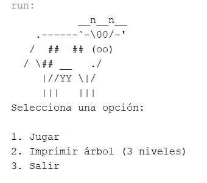

# LaVaca
Project for my Data Structures class. It's a self-learning guessing game that stores and retrieves information from binary trees. 
The gameplay and documentation is in Spanish. An English translation is in the works.

For download I recommend importing the project to NetBeans using the zip file.

Screenshots:

